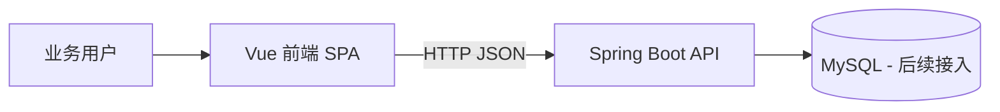

# 技术设计: 烟草采销存协同管理平台初始化

## 技术方案
### 核心技术
- Java 8
- Spring Boot 2.7.x
- Maven
- Vue 3
- Vite
- Vue Router
- Pinia
- Axios

### 实现要点
- 后端使用单体 Spring Boot 工程作为 API 服务起点，预留 controller/service/dto/common/config 分层
- 前端使用 Vue 3 单页应用，采用布局 + 路由页面方式承载业务模块
- 根目录以 README 说明工程启动方式，知识库记录架构和模块边界

## 架构设计


## 架构决策 ADR
### ADR-001: 前端采用 Vue 而非 JSP
**上下文:** 文档中的既有技术参考包含 JSP，但用户明确要求以前后端分离方式实现前端。
**决策:** 使用 Vue 3 + Vite 构建独立前端工程，通过 HTTP 调用 Spring Boot 后端接口。
**理由:** 更符合现代前后端分离开发方式，也便于模块扩展、界面重构与后续部署。
**替代方案:** JSP 服务端渲染页面 → 拒绝原因: 与用户要求冲突，且不利于前后端职责解耦。
**影响:** 需要维护两个子项目与跨域配置，但整体可维护性更高。

## API设计
### [GET] /api/health
- **请求:** 无
- **响应:** `{ code, message, data }`

### [GET] /api/dashboard/summary
- **请求:** 无
- **响应:** 返回采购、库存、销售、预警等概览统计占位数据

## 数据模型
```sql
-- 初始阶段仅定义核心领域对象，后续再映射为实际表结构
-- users(id, username, role, status, created_at)
-- tobacco_items(id, code, name, category, unit_price, status)
-- suppliers(id, name, contact_name, contact_phone, status)
-- purchase_orders(id, order_no, supplier_id, status, total_amount, created_at)
-- inventory_records(id, item_id, warehouse_name, quantity, warning_threshold)
-- sales_orders(id, order_no, customer_name, status, total_amount, created_at)
```

## 安全与性能
- **安全:** 后端统一响应结构，预留 CORS 配置；不提交任何真实密钥或生产配置
- **性能:** 当前以工程骨架为主，仅返回轻量示例数据；后续接入数据库时再完善分页与缓存

## 测试与部署
- **测试:** 后端执行 Maven 打包校验；前端执行 npm install 与 npm run build
- **部署:** 当前仅支持本地开发启动，后续可拆分为前端静态部署 + 后端独立服务部署
