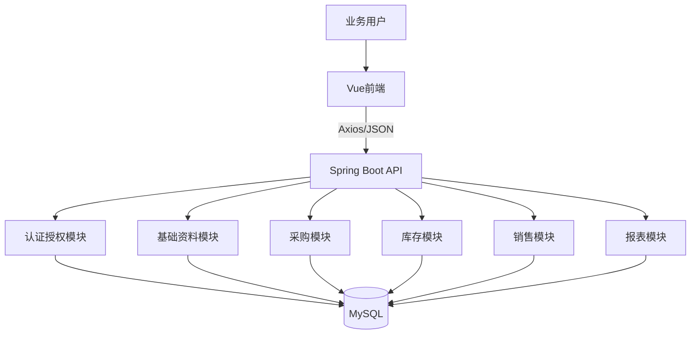

# 技术设计: 烟草采销存协同管理平台全功能实施方案

## 技术方案
### 核心技术
- 后端：Java 8、Spring Boot 2.7、Spring MVC、Spring Validation
- 数据访问：MyBatis 或 MyBatis-Plus（二选一，推荐 MyBatis-Plus 提升 CRUD 开发效率）
- 认证授权：Spring Interceptor + JWT + RBAC
- 数据库：MySQL 8
- 前端：Vue 3、Vite、Vue Router、Pinia、Axios
- UI：Element Plus（推荐）
- 图表：ECharts
- 导出：Apache POI（后端）

### 实现要点
- 保持前后端分离：前端只负责 UI、状态与交互；后端通过 REST API 提供业务能力
- 按领域拆分后端模块：auth、system、catalog、supplier、purchase、inventory、sales、report
- 前端按业务域拆分页面与 API：登录、首页、系统管理、采购管理、库存管理、销售管理、报表中心
- 引入统一字典与状态枚举，避免订单状态、库存类型、角色编码分散硬编码
- 所有关键业务操作保留操作日志与状态流转记录，便于追溯和论文说明

## 架构设计


## 架构决策 ADR
### ADR-002: 采用前后端分离单体架构承载毕业设计全功能
**上下文:** 当前项目规模适合毕业设计交付，但功能模块较多，需兼顾实现效率与结构清晰度。
**决策:** 后端继续采用单体 Spring Boot 分层架构，前端采用 Vue 单页应用，通过业务域分模块开发。
**理由:** 单体架构更适合当前阶段快速交付、论文说明和本地部署，同时可保留清晰领域边界。
**替代方案:** 微服务拆分 → 拒绝原因: 复杂度过高，不适合当前毕业设计时间窗口。
**影响:** 单体工程需要严格模块边界与命名规范，避免后期耦合失控。

### ADR-003: 使用 JWT + RBAC 实现认证授权
**上下文:** 系统存在管理员、采购、销售、库管等多角色访问控制需求。
**决策:** 登录成功后发放 JWT，前端持有令牌；后端通过拦截器校验身份，并基于角色/权限点控制接口访问。
**理由:** 实现成本适中、便于前后端分离、足以覆盖毕业设计权限模型。
**替代方案:** Session + 服务端 JSP 权限控制 → 拒绝原因: 与 Vue 前后端分离方案不一致。
**影响:** 需要实现令牌续期/失效处理和前端统一鉴权跳转。

## API设计
### 认证与用户
- `POST /api/auth/login`：用户登录
- `GET /api/auth/profile`：获取当前用户信息与菜单
- `POST /api/auth/logout`：退出登录
- `GET /api/users`：分页查询用户
- `POST /api/users`：新增用户
- `PUT /api/users/{id}`：更新用户
- `PUT /api/users/{id}/status`：启停用用户
- `GET /api/roles`：查询角色列表
- `POST /api/roles`：新增角色
- `PUT /api/roles/{id}/permissions`：分配权限

### 基础资料
- `GET /api/categories`：查询烟草品类
- `POST /api/categories`：新增品类
- `GET /api/products`：分页查询商品
- `POST /api/products`：新增商品
- `PUT /api/products/{id}`：修改商品
- `GET /api/suppliers`：分页查询供应商
- `POST /api/suppliers`：新增供应商
- `PUT /api/suppliers/{id}`：更新供应商

### 采购管理
- `GET /api/purchases`：采购单分页
- `POST /api/purchases`：创建采购单
- `GET /api/purchases/{id}`：采购单详情
- `PUT /api/purchases/{id}`：编辑采购单
- `POST /api/purchases/{id}/submit`：提交审核
- `POST /api/purchases/{id}/receive`：登记到货
- `POST /api/purchases/{id}/inbound`：采购入库

### 库存管理
- `GET /api/inventories`：库存分页查询
- `GET /api/inventory-records`：库存流水查询
- `POST /api/inventory-transfers`：库存调拨
- `POST /api/inventory-checks`：库存盘点
- `GET /api/inventory-warnings`：库存预警列表

### 销售管理
- `GET /api/sales`：销售单分页
- `POST /api/sales`：创建销售单
- `GET /api/sales/{id}`：销售单详情
- `POST /api/sales/{id}/outbound`：销售出库
- `POST /api/sales/{id}/payment`：登记回款
- `GET /api/sales/statistics`：销售统计

### 首页与报表
- `GET /api/dashboard/summary`：首页统计
- `GET /api/reports/purchase-summary`：采购汇总报表
- `GET /api/reports/sales-summary`：销售汇总报表
- `GET /api/reports/inventory-summary`：库存汇总报表
- `GET /api/reports/trend`：经营趋势图表
- `GET /api/reports/export`：导出报表

## 数据模型
```sql
-- 用户与权限
users(id, username, password, real_name, role_id, status, created_at, updated_at)
roles(id, code, name, remark)
permissions(id, code, name, type, parent_id)
role_permissions(id, role_id, permission_id)
operation_logs(id, operator_id, module, action, target_id, content, created_at)

-- 基础资料
categories(id, name, remark, status)
products(id, code, name, category_id, unit, unit_price, warning_threshold, status)
suppliers(id, name, contact_name, contact_phone, address, status)
customers(id, name, contact_name, contact_phone, address, status)

-- 采购
purchase_orders(id, order_no, supplier_id, status, total_amount, created_by, created_at)
purchase_order_items(id, order_id, product_id, quantity, unit_price, amount)
purchase_receipts(id, order_id, receipt_no, received_by, received_at, remark)
purchase_receipt_items(id, receipt_id, product_id, quantity)

-- 库存
inventories(id, product_id, warehouse_name, quantity, locked_quantity, warning_threshold, updated_at)
inventory_records(id, product_id, biz_type, biz_id, change_qty, before_qty, after_qty, operator_id, created_at)
inventory_checks(id, check_no, warehouse_name, status, created_by, created_at)
inventory_check_items(id, check_id, product_id, system_qty, actual_qty, diff_qty)
inventory_transfers(id, transfer_no, from_warehouse, to_warehouse, status, created_by, created_at)
inventory_transfer_items(id, transfer_id, product_id, quantity)

-- 销售
sales_orders(id, order_no, customer_id, status, total_amount, paid_amount, created_by, created_at)
sales_order_items(id, order_id, product_id, quantity, unit_price, amount)
sales_outbounds(id, order_id, outbound_no, outbound_by, outbound_at)
sales_outbound_items(id, outbound_id, product_id, quantity)
payment_records(id, sales_order_id, amount, paid_at, payer_name, remark)
```

## 前端信息架构
- 登录页：账号密码登录、登录态恢复、退出登录
- 首页：经营概览、快捷入口、预警卡片、趋势图
- 系统管理：用户管理、角色权限、商品资料、供应商管理、客户管理
- 采购管理：采购单列表、创建/编辑、详情、到货登记、入库记录
- 库存管理：库存台账、库存流水、调拨单、盘点单、预警列表
- 销售管理：销售单列表、详情、出库登记、回款登记、销售统计
- 报表中心：采购汇总、销售汇总、库存汇总、趋势分析、导出

## 安全与性能
- **安全:**
  - 密码加密存储，不保存明文密码
  - 所有写操作接口进行身份校验与权限校验
  - 表单输入进行后后端双重校验
  - 关键业务操作记录日志，确保可审计
  - 前端路由守卫拦截未登录访问
- **性能:**
  - 列表查询统一分页
  - 首页统计与报表接口可按需增加缓存
  - 大报表导出采用异步生成或分页导出策略
  - 前端通用表格、搜索表单、详情抽屉组件化复用

## 测试与部署
- **测试:**
  - 后端：单元测试 + 关键流程集成测试（登录、采购入库、销售出库、库存预警）
  - 前端：页面渲染、路由守卫、关键表单提交流程验证
  - 联调：保证采购入库会增库存、销售出库会减库存、回款会更新统计
- **部署:**
  - 开发环境：前端 `npm run dev`，后端 `mvn spring-boot:run`
  - 生产/答辩环境：前端打包后部署静态资源，后端独立 Jar 启动
