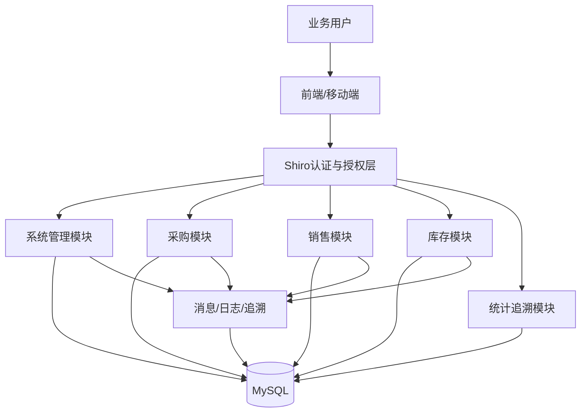

# 技术设计: 任务书对齐的后端功能补齐与架构重构

## 技术方案
### 核心技术
- Java 8 / Spring Boot 2.7
- Apache Shiro（认证、授权、密码哈希、会话/Token 集成）
- Spring JDBC（保留当前数据访问风格，避免无谓 ORM 重构）
- MySQL 8（扩展数据模型）
- Apache POI（Excel 导入导出）
- JUnit + MockMvc（集成测试）

### 实现要点
- 以当前 Spring Boot 项目为基础重构，不推翻分层结构。
- 认证改为 `ShiroConfig + Realm + Filter`，逐步替换 `AuthInterceptor + JwtTokenUtil`。
- 权限模型采用“用户 - 角色 - 权限 - 菜单 - 数据范围”结构。
- 核心业务采用“单据主表 + 状态字段 + 审核记录/追溯日志 + 通知消息”的统一设计。
- Excel 接口按模块统一提供模板下载、导入校验、导出明细三类能力。

## 架构设计


## 架构决策 ADR
### ADR-005: 认证与授权统一迁移到 Apache Shiro
**上下文:** 当前系统使用 JWT + 自定义拦截器，只能进行粗粒度登录校验，无法满足任务书要求的 Shiro 与 RBAC 细粒度控制。
**决策:** 引入 Apache Shiro，使用自定义 Realm 统一处理认证、角色、权限和密码哈希；对现有接口增加权限注解或统一授权校验。
**理由:** 满足任务书要求，且 Shiro 自带认证授权与密码加密能力，适合当前传统 Spring Boot 项目。
**替代方案:** 延续 JWT 并补充自定义 RBAC → 拒绝原因: 与任务书要求不一致，且仍需重复造授权轮子。
**影响:** 认证链、会话上下文、密码存储、接口授权与测试均需同步调整。

### ADR-006: 业务重构采用“增量表结构扩展 + 分阶段迁移”而非一次性重写
**上下文:** 当前采购/销售/库存模块已存在最小实现，若直接整体推翻，风险高且难以回归验证。
**决策:** 保留现有模块边界，扩展表结构与服务职责，引入审核、日志、追溯、消息等新能力，逐步替换旧逻辑。
**理由:** 能控制改动风险，便于阶段性测试和文档同步。
**替代方案:** 新建第二套模块完全重写 → 拒绝原因: 重复代码多，迁移与联调成本过高。
**影响:** SQL 初始化脚本、服务接口、前端契约和知识库需同步演进。

### ADR-007: Excel 批处理统一采用 Apache POI
**上下文:** 当前仅支持 CSV 导出，无法满足任务书中 Excel 导入导出要求。
**决策:** 所有采购、销售、库存相关批处理统一引入 Apache POI，输出 `.xlsx`，导入时先校验后入库。
**理由:** 兼容性高，可扩展模板、批注、错误回填。
**替代方案:** 继续使用 CSV → 拒绝原因: 不满足任务书“Excel 导入导出”要求。
**影响:** `pom.xml`、导出接口、导入校验、测试样例均需新增。

## API设计
### POST /api/auth/login
- **请求:** username、password、captchaKey、captchaCode
- **响应:** 用户信息、角色、权限、菜单、token/session 标识

### POST /api/auth/forgot-password
- **请求:** username、captchaKey、captchaCode
- **响应:** 重置凭证或成功提示

### POST /api/auth/reset-password
- **请求:** username、resetToken、newPassword
- **响应:** 成功状态

### GET /api/logs/login
- **请求:** 分页、用户名、时间范围
- **响应:** 登录日志列表

### GET /api/logs/operation
- **请求:** 分页、模块、操作类型、时间范围
- **响应:** 操作日志列表

### CRUD /api/users /api/roles /api/permissions /api/config
- **请求:** 账号、角色、权限、数据范围、系统配置相关结构
- **响应:** 列表、详情、创建/更新结果

### CRUD /api/purchase-requisitions
- **请求:** 采购需求提报信息
- **响应:** 需求单列表、详情、状态更新结果

### CRUD /api/purchases + /audit + /cancel + /import + /export + /trace
- **请求:** 采购单主体、审核意见、Excel 文件
- **响应:** 单据、审核结果、导入结果、Excel 文件、跟踪链路

### CRUD /api/sales-publishes /api/sales + /audit + /cancel + /import + /export + /receivables
- **请求:** 销售信息、销售单、回款查询参数、Excel 文件
- **响应:** 信息发布、销售单、回款状态、导入导出结果

### GET/POST /api/inventories /api/inventory-records /api/inventory-warnings /api/inventory-import /api/inventory-export /api/inventory-checks
- **请求:** 台账筛选、批量导入、盘点数据、预警查询
- **响应:** 台账、明细、预警、导入结果、Excel 文件

### GET /api/reports/psi-summary /api/reports/compliance-trace /api/reports/abnormal-docs /api/reports/linkage
- **请求:** 时间、品类、仓库、供应商、客户等维度参数
- **响应:** 汇总报表、追溯链、异常单据、联动图表数据

### GET /api/messages / POST /api/messages/{id}/read
- **请求:** 分页、消息类型
- **响应:** 消息列表、已读结果

## 数据模型
```sql
-- 认证与权限
roles(code,name,remark,status)
permissions(code,name,module,action,remark)
role_permissions(role_code,permission_code)
user_data_scopes(user_id,scope_type,scope_value)
login_logs(user_id,username,ip,device,status,message,created_at)
operation_logs(user_id,username,module,action,biz_type,biz_id,detail,created_at)
captcha_records(captcha_key,captcha_code,expire_at,status)
password_reset_records(user_id,reset_token,expire_at,status,created_at)
system_configs(config_key,config_value,config_group,remark,updated_at)
messages(id,user_id,title,content,message_type,biz_type,biz_id,is_read,created_at,read_at)

-- 基础信息扩展
warehouses(id,code,name,address,status)
products(..., default_supplier_id, compliance_code)
customers(..., credit_limit)
suppliers(..., license_no)

-- 采购
purchase_requisitions(id,req_no,product_id,quantity,reason,status,created_by,created_at,audited_by,audited_at,audit_remark)
purchase_orders(..., requisition_id, audit_status, audit_by, audit_at, cancel_reason, excel_batch_no)
purchase_order_tracks(id,purchase_order_id,node_code,node_name,operator,remark,created_at)

-- 销售
sales_publishings(id,publish_no,title,content,product_id,price,status,created_by,created_at)
sales_orders(..., publish_id, audit_status, audit_by, audit_at, cancel_reason, receivable_status)
receivable_records(id,sales_order_id,amount,status,due_date,paid_at,remark)

-- 库存与追溯
inventories(..., warehouse_id, locked_qty)
inventory_records(..., warehouse_id, source_module, source_order_no)
inventory_check_reports(id,report_no,warehouse_id,product_id,system_qty,actual_qty,profit_loss_qty,status,created_by,created_at)
warning_records(id,warning_type,product_id,warehouse_id,threshold,current_value,status,created_at)
trace_records(id,biz_type,biz_id,order_no,node_code,node_name,operator,remark,created_at)
abnormal_documents(id,biz_type,biz_id,order_no,abnormal_type,status,reported_by,created_at,audited_by,audited_at)
```

## 安全与性能
- **安全:**
  - 使用 Shiro `HashedCredentialsMatcher` 进行密码哈希存储，禁止明文密码。
  - 登录、重置密码、导入接口均做验证码/权限/参数校验。
  - 导入文件限制类型、大小、模板格式，防止恶意文件。
  - 关键操作统一写入登录日志、操作日志、追溯记录。
  - 数据范围在服务层和 SQL 层双重限制，避免越权查询。
- **性能:**
  - 列表接口统一分页。
  - 报表聚合优先使用 SQL 汇总并建立必要索引。
  - 大批量导入采用分批写入与错误收集。
  - 预警检测可先同步生成，后续如必要再扩展定时任务。

## 测试与部署
- **测试:**
  - 为认证、权限、采购、销售、库存、报表、Excel 导入导出、日志追溯补充 MockMvc 集成测试。
  - 增加状态流转、权限拒绝、导入失败、异常审核等场景测试。
- **部署:**
  - 先执行数据库 schema/data 迁移。
  - 再上线 Shiro 配置与业务代码。
  - 最后联调前端并回归任务书全清单。
