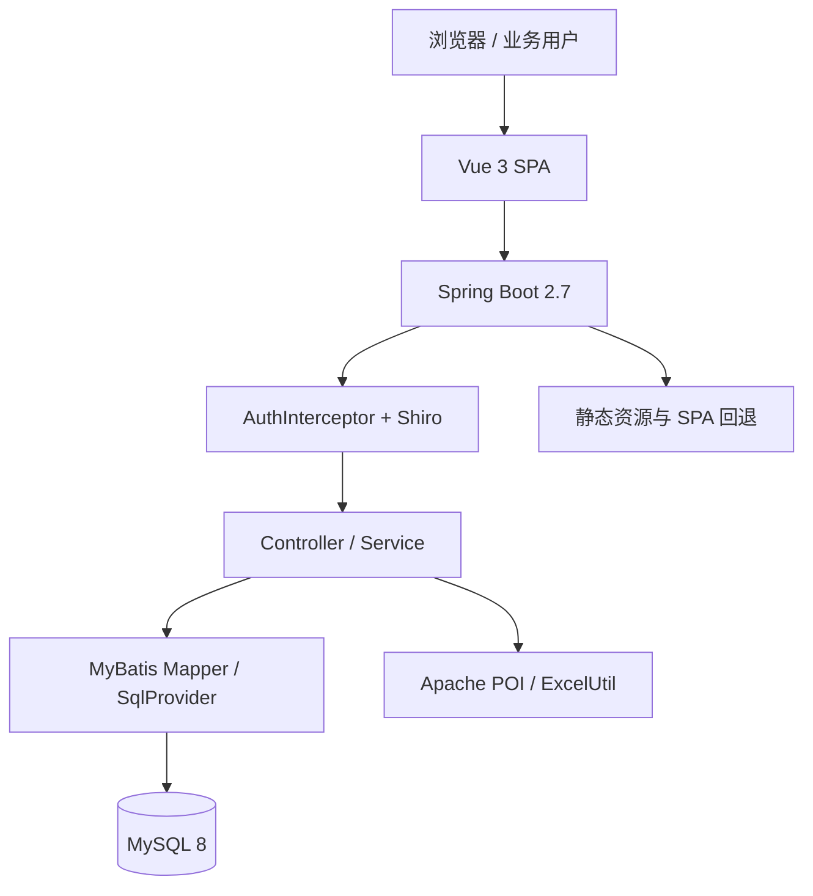
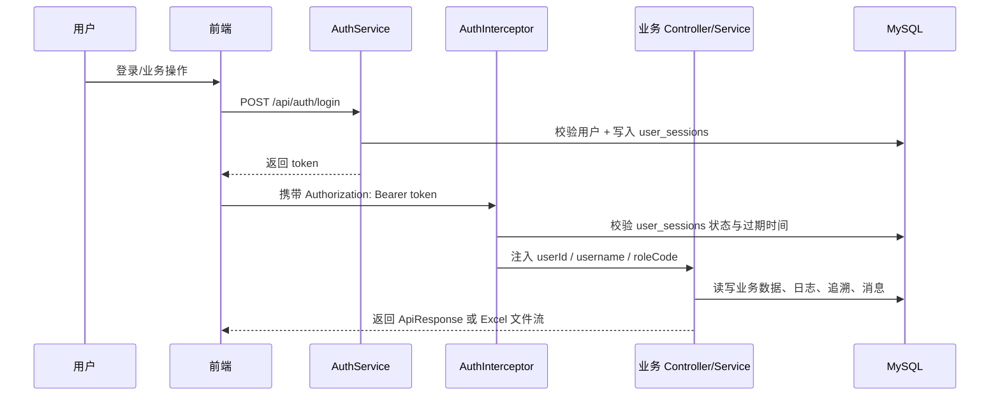

# 架构设计

## 总体架构

## 技术栈
- **后端:** Java 8 / Spring Boot 2.7.18 / Apache Shiro / MyBatis 注解与 SqlProvider / Apache POI
- **前端:** Vue 3 / Vite / Vue Router / Pinia / Axios / Element Plus / ECharts / TypeScript
- **数据:** MySQL 8

## 模块划分
- `auth`：验证码、登录、会话令牌生成、忘记密码、重置密码、当前用户资料
- `interceptor` / `config`：`AuthInterceptor` 统一拦截 Bearer 会话，`WebConfig` 注册拦截器，`ShiroConfig` 提供认证能力
- `system`：用户、角色、权限、系统配置、个人中心、仓库
- `audit` / `message`：登录日志、操作日志、追溯、异常单据、站内消息
- `catalog` / `supplier` / `customer`：商品、品类、供应商、客户基础资料
- `purchase`：采购单创建、编辑、审核、取消、到货、入库、导入、追溯
- `sales`：公告发布、销售单创建、编辑、审核、取消、出库、回款、统计、应收、导入
- `inventory`：多仓库存总览、流水、调拨、盘点、预警、导入
- `report` / `dashboard`：经营概览、历史销售对比、汇总报表、联动分析、异常审核、统一追溯查询、Excel 导出
- `frontend`：工作台布局、动态路由、按钮权限、图表、表格与导出交互

## 运行与部署约定
- 默认采用单后端入口：Spring Boot 统一提供 `/api/*` 与前端静态资源
- 前端构建输出目录固定为 `backend/src/main/resources/static/`
- `SpaForwardController` 负责常用业务页的 SPA history 回退（含销售出库页）
- 常规联调和验收统一访问 `http://localhost:8080`
- `http://localhost:5173` 仅用于前端局部开发；代理 `/api` 到后端

## 认证与请求链路

## 当前架构要点
- 真实鉴权以数据库会话为准，`JwtTokenUtil` 仅保留兼容层壳实现
- 控制器层除导出接口外，统一通过 `ApiResponse` 返回 `code/message/data`
- 数据访问已统一收口到 MyBatis Mapper，复杂查询通过 `SqlProvider` 构建
- 报表导出使用后端 `ExcelUtil` 生成 `.xlsx`，前端本地导出使用 `xlsx` / `file-saver`
- 库存模型已升级为“商品 + 仓库”双维度唯一库存
- 统一追溯查询层通过聚合 `trace_records` 与 `inventory_records`，同时提供业务节点与库存变化两类视角

## 重大架构决策
| adr_id | title | date | status | affected_modules | details |
|--------|-------|------|--------|------------------|---------|
| ADR-001 | 前端采用 Vue 而非 JSP | 2026-03-23 | ✅已采纳 | frontend, backend | [202603230000_tobacco-platform-init](../history/2026-03/202603230000_tobacco-platform-init/how.md#adr-001-前端采用-vue-而非-jsp) |
| ADR-005 | 认证与授权迁移为 Apache Shiro + RBAC | 2026-03-24 | ✅已采纳 | auth, system | [../history/2026-03/202603240318_taskbook-backend-alignment/how.md](../history/2026-03/202603240318_taskbook-backend-alignment/how.md) |
| ADR-006 | 业务扩展采用增量表结构扩展 + 分阶段迁移 | 2026-03-24 | ✅已采纳 | purchase, sales, inventory, report | [../history/2026-03/202603240318_taskbook-backend-alignment/how.md](../history/2026-03/202603240318_taskbook-backend-alignment/how.md) |
| ADR-007 | Excel 批处理统一采用 Apache POI | 2026-03-24 | ✅已采纳 | purchase, sales, inventory, report | [../history/2026-03/202603240318_taskbook-backend-alignment/how.md](../history/2026-03/202603240318_taskbook-backend-alignment/how.md) |
| ADR-008 | 前端升级为工作台风格并启用 TypeScript 能力 | 2026-03-24 | ✅已采纳 | frontend | [../history/2026-03/202603240320_frontend-second-optimization](../history/2026-03/202603240320_frontend-second-optimization/) |
| ADR-20260329 | 数据访问层采用测试先行的 MyBatis 注解渐进迁移 | 2026-03-29 | ✅已采纳 | auth, audit, message, catalog, customer, supplier, purchase, sales, inventory, system, report, dashboard | [../history/2026-03/202603290208_mybatis-annotation-migration/how.md](../history/2026-03/202603290208_mybatis-annotation-migration/how.md) |
| ADR-20260412-01 | 保留 trace_records + inventory_records 双模型，通过统一查询层收口库存追溯 | 2026-04-12 | ✅已采纳 | inventory, report, sales, frontend | [../plan/202604120207_sales-outbound-trace-completion/how.md](../plan/202604120207_sales-outbound-trace-completion/how.md) |
