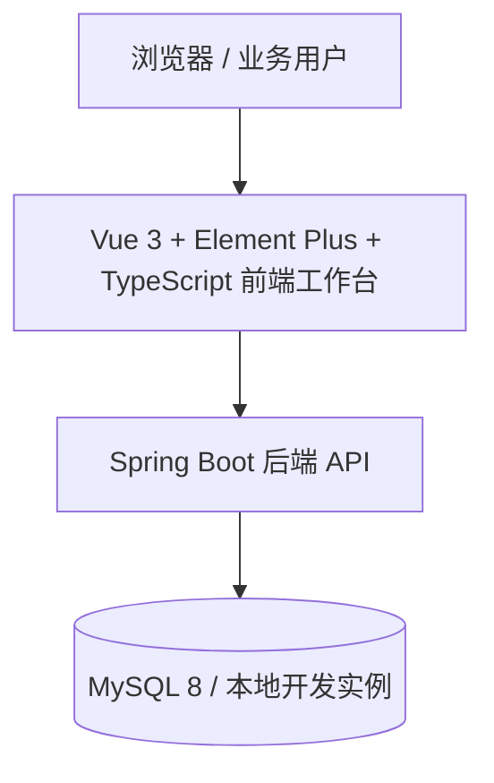
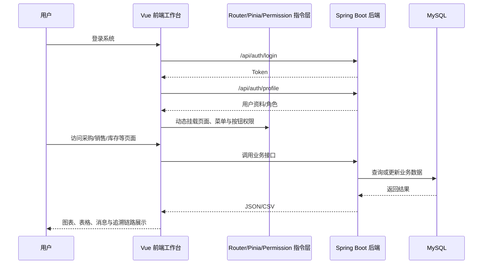

# 架构设计

## 总体架构

## 技术栈
- **后端:** Java 8 语法兼容 / Spring Boot 2.7 / Spring JDBC / JWT
- **前端:** Vue 3 / Vite / Vue Router / Pinia / Axios / Element Plus / ECharts / xlsx / file-saver / TypeScript / vue-tsc
- **数据:** MySQL 8

## 模块划分
- `auth`：登录、令牌、当前用户信息、前端登录页
- `frontend-shell`：后台布局、动态菜单、主题切换、消息提醒、权限守卫、无权限页
- `system`：用户、角色、基础资料、系统配置、日志
- `purchase`：采购订单、采购表单、到货入库、采购分析
- `inventory`：库存总览、流水、盘点、追溯台账
- `sales`：销售订单、销售表单、出库、回款、绩效分析
- `report`：经营大屏、合规追溯、异常审核、CSV 导出
- `frontend-core`：TypeScript 类型声明、权限指令、构建拆包配置、通用表格/图表组件

## 核心流程

## 重大架构决策
| adr_id | title | date | status | affected_modules | details |
|--------|-------|------|--------|------------------|---------|
| ADR-001 | 前端采用 Vue 而非 JSP | 2026-03-23 | ✅已采纳 | frontend, backend | [202603230000_tobacco-platform-init](../history/2026-03/202603230000_tobacco-platform-init/how.md#adr-001-前端采用-vue-而非-jsp) |
| ADR-002 | 使用 Docker 临时 MySQL 进行本地联调 | 2026-03-23 | ✅已采纳 | backend, frontend | [202603231548_full-platform-features](../history/2026-03/202603231548_full-platform-features/how.md) |
| ADR-003 | 报表导出接口改为真实 CSV 输出 | 2026-03-24 | ✅已采纳 | backend, frontend | [202603240034_doc-alignment-report-fix](../history/2026-03/202603240034_doc-alignment-report-fix/how.md#adr) |
| ADR-004 | 采购流程拆分为到货与入库两个动作 | 2026-03-24 | ✅已采纳 | backend, frontend, procurement | [202603240034_doc-alignment-report-fix](../history/2026-03/202603240034_doc-alignment-report-fix/how.md#adr) |
| ADR-005 | 前端界面统一切换为 Element Plus 后台工作台风格 | 2026-03-24 | ✅已采纳 | frontend, admin, procurement, sales, inventory, report | [202603240230_frontend-page-refactor](../history/2026-03/202603240230_frontend-page-refactor/how.md) |
| ADR-006 | 权限控制采用“后端资料 + 角色兜底推导 + 动态路由挂载” | 2026-03-24 | ✅已采纳 | frontend, auth | [202603240230_frontend-page-refactor](../history/2026-03/202603240230_frontend-page-refactor/how.md) |
| ADR-007 | 前端构建流程增加 TypeScript 静态校验并进行手动拆包 | 2026-03-24 | ✅已采纳 | frontend, build | [202603240320_frontend-second-optimization](../history/2026-03/202603240320_frontend-second-optimization/how.md) |
| ADR-008 | 前端权限控制新增按钮级指令与无权限提示页 | 2026-03-24 | ✅已采纳 | frontend, auth, admin, procurement, sales, inventory, report | [202603240320_frontend-second-optimization](../history/2026-03/202603240320_frontend-second-optimization/how.md) |
