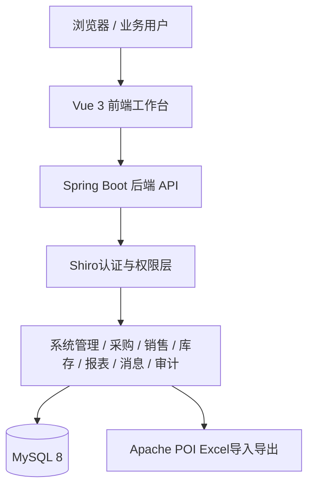
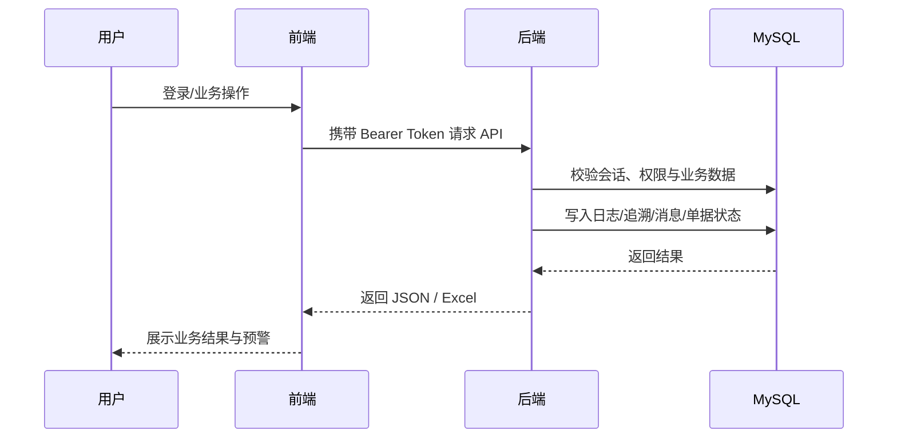

# 架构设计

## 总体架构

## 技术栈
- **后端:** Java 8 / Spring Boot 2.7 / Spring JDBC / Apache Shiro / Apache POI
- **前端:** Vue 3 / Vite / Vue Router / Pinia / Axios / Element Plus / ECharts / TypeScript
- **数据:** MySQL 8

## 模块划分
- `auth`：登录、验证码、忘记/重置密码、会话令牌、菜单与权限返回
- `system`：用户、角色、权限、系统配置、个人中心、仓库管理
- `audit`：登录日志、操作日志、追溯与异常记录
- `message`：站内消息、预警通知已读管理
- `catalog` / `supplier` / `customer`：基础主数据管理
- `purchase`：采购需求、采购单、审核、跟踪、到货、入库、Excel
- `sales`：信息发布、销售单、审核、出库、回款、应收、Excel
- `inventory`：库存台账、调拨、盘点、预警、预警历史、Excel
- `report`：采销存汇总、联动分析、合规追溯、异常单据、报表导出
- `frontend`：后台工作台、动态路由、按钮权限、图表与导出交互

## 核心流程

## 重大架构决策
| adr_id | title | date | status | affected_modules | details |
|--------|-------|------|--------|------------------|---------|
| ADR-001 | 前端采用 Vue 而非 JSP | 2026-03-23 | ✅已采纳 | frontend, backend | [202603230000_tobacco-platform-init](../history/2026-03/202603230000_tobacco-platform-init/how.md#adr-001-前端采用-vue-而非-jsp) |
| ADR-005 | 认证与授权迁移为 Apache Shiro + RBAC | 2026-03-24 | ✅已采纳 | auth, system | [../history/2026-03/202603240318_taskbook-backend-alignment/how.md](../history/2026-03/202603240318_taskbook-backend-alignment/how.md) |
| ADR-006 | 业务扩展采用增量表结构扩展 + 分阶段迁移 | 2026-03-24 | ✅已采纳 | purchase, sales, inventory, report | [../history/2026-03/202603240318_taskbook-backend-alignment/how.md](../history/2026-03/202603240318_taskbook-backend-alignment/how.md) |
| ADR-007 | Excel 批处理统一采用 Apache POI | 2026-03-24 | ✅已采纳 | purchase, sales, inventory, report | [../history/2026-03/202603240318_taskbook-backend-alignment/how.md](../history/2026-03/202603240318_taskbook-backend-alignment/how.md) |
| ADR-008 | 前端升级为工作台风格并启用 TypeScript 能力 | 2026-03-24 | ✅已采纳 | frontend | [../history/2026-03/202603240320_frontend-second-optimization](../history/2026-03/202603240320_frontend-second-optimization/) |
