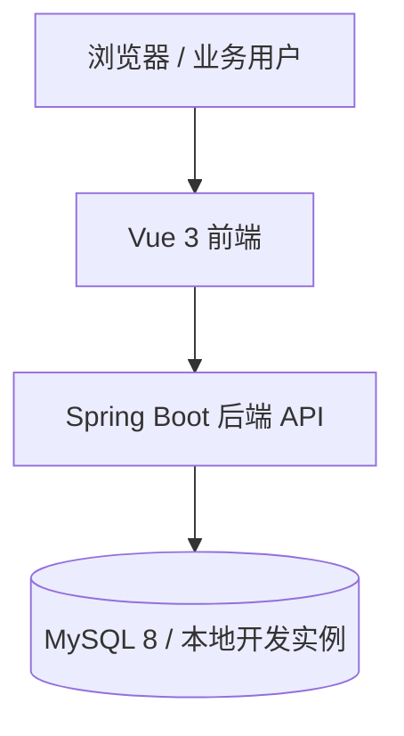
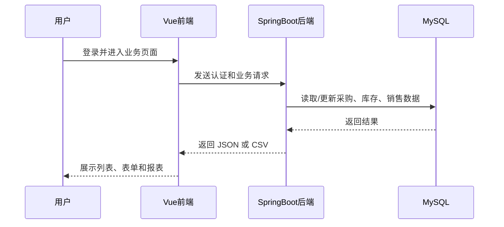

# 架构设计

## 总体架构

## 技术栈
- **后端:** Java 8 语法兼容 / Spring Boot 2.7 / Spring JDBC / JWT
- **前端:** Vue 3 / Vite / Vue Router / Pinia / Axios / ECharts
- **数据:** MySQL 8

## 模块划分
- `auth`：登录、令牌、当前用户信息
- `system`：用户、角色
- `catalog`：品类、商品
- `supplier` / `customer`：基础往来单位资料
- `purchase`：采购创建、到货、入库
- `inventory`：库存台账、预警、盘点、调拨记录
- `sales`：销售创建、出库、回款
- `report`：汇总报表、趋势与 CSV 导出

## 核心流程

## 重大架构决策
| adr_id | title | date | status | affected_modules | details |
|--------|-------|------|--------|------------------|---------|
| ADR-001 | 前端采用 Vue 而非 JSP | 2026-03-23 | ✅已采纳 | frontend, backend | [202603230000_tobacco-platform-init](../history/2026-03/202603230000_tobacco-platform-init/how.md#adr-001-前端采用-vue-而非-jsp) |
| ADR-002 | 使用 Docker 临时 MySQL 进行本地联调 | 2026-03-23 | ✅已采纳 | backend, frontend | [202603231548_full-platform-features](../history/2026-03/202603231548_full-platform-features/how.md) |
| ADR-003 | 报表导出接口改为真实 CSV 输出 | 2026-03-24 | ✅已采纳 | backend, frontend | [202603240034_doc-alignment-report-fix](../history/2026-03/202603240034_doc-alignment-report-fix/how.md#adr) |
| ADR-004 | 采购流程拆分为到货与入库两个动作 | 2026-03-24 | ✅已采纳 | backend, frontend, procurement | [202603240034_doc-alignment-report-fix](../history/2026-03/202603240034_doc-alignment-report-fix/how.md#adr) |
